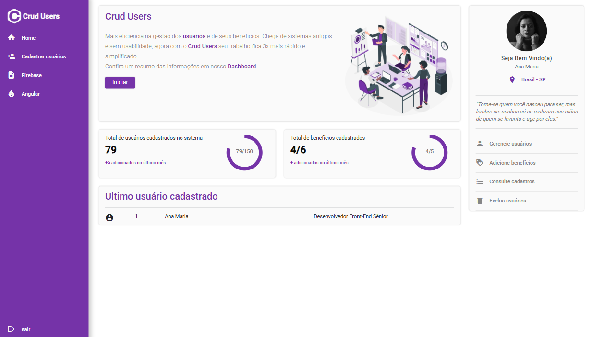
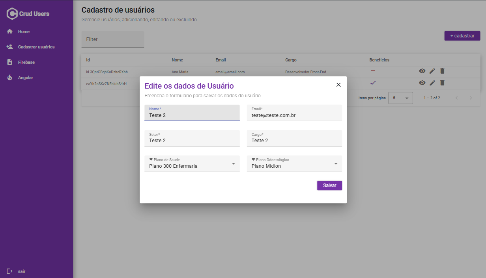

# CRUD Usuários – Sistema de Gerenciamento

Aplicação desenvolvida em Angular 17, Angular Material e Firebase, com foco em um CRUD completo de usuários e seus benefícios, com interface moderna, responsiva e organizada por boas práticas de arquitetura.

## 🚀 Tecnologias Utilizadas

- **Angular 17**
- **Angular Material**
- **Firebase Firestore**
- **RxJS**
- **TypeScript**
- **SCSS**
- **Reactive Forms**

## 📸 Screenshots

### 🏠 Dashboard


### ✏️ Modal de Edição


## 📌 Funcionalidades

### 👥 Gestão de Usuários
- Cadastro com validações reativas
- Edição via modal (Angular Material Dialog)
- Exclusão de usuários
- Listagem com tabela dinâmica
- Visualização de benefícios
- Regras de validação entre plano odontológico e plano de saúde

### 📊 Dashboard
- Total de usuários
- Total de benefícios
- Último usuário cadastrado
- Indicadores em gráficos circulares

### 🔐 Autenticação (Login básico)
- Tela de login estruturada para futura integração com Firebase Auth

## 🏗️ Arquitetura do Projeto


    src/
    └── app/
    ├── components/
    │   ├── button/
    │   └── menu/
    │
    ├── interfaces/
    │   └── user.ts
    │
    ├── pages/
    │   ├── crud/
    │   │   ├── modal-form-user/
    │   │   ├── modal-view-user/
    │   │   ├── crud.component.ts
    │   │   ├── crud.component.html
    │   │   ├── crud.component.css
    │   │   └── crud.component.spec.ts
    │   │
    │   ├── home/
    │   └── login/
    │
    ├── services/
    │   └── users.service.ts
    │
    ├── app-routing.module.ts
    ├── app.module.ts
    ├── app.component.ts
    ├── app.component.html
    └── app.component.css


## 🔥 Configuração do Firebase

Crie o arquivo: `src/environments/environment.ts`

E adicione:

```typescript
export const environment = {
  firebaseConfig: {
    apiKey: "...",
    authDomain: "...",
    projectId: "...",
    storageBucket: "...",
    messagingSenderId: "...",
    appId: "..."
  }
};
```


⚙️ Como Rodar o Projeto

#### 1️⃣ Instalar dependências
```typescript
npm install
```

#### 2️⃣ Rodar o servidor local
```typescript
ng serve
```

#### 3️⃣ Abrir no navegador
```typescript
http://localhost:4200
```


## ✔️ Destaques Técnicos
Reactive Forms com validações personalizadas

Uso avançado do Angular Material (Dialog, Inputs, Tabela, Botões etc.)

Firebase Firestore + RxJS (Observables)

Componentes reutilizáveis (Menu, Button)

Arquitetura modular e escalável

CSS organizado e responsivo

👩‍💻 Autora
Ana Maria
Frontend Developer – Angular

